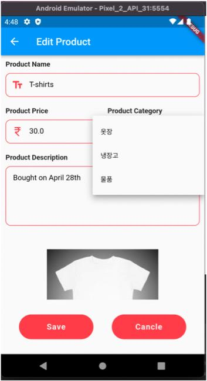
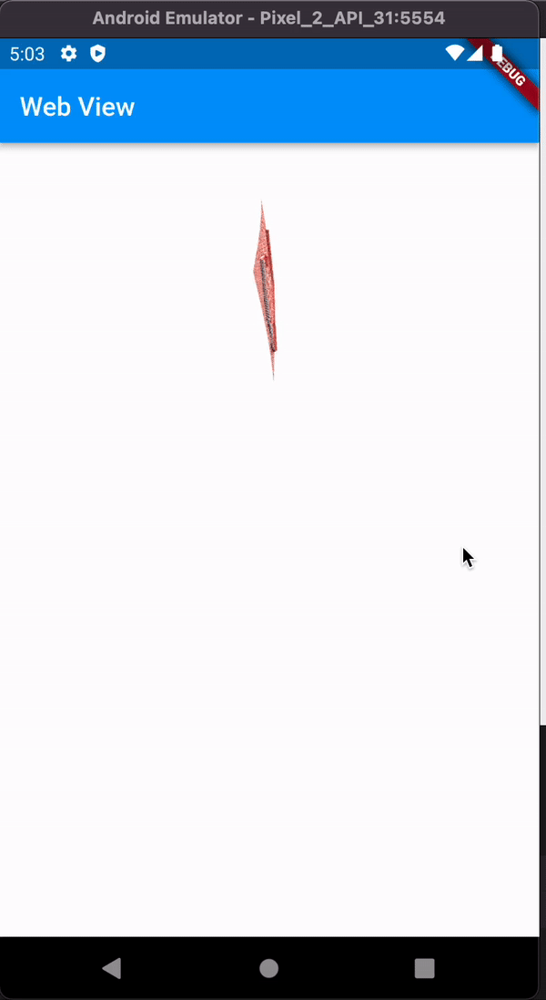
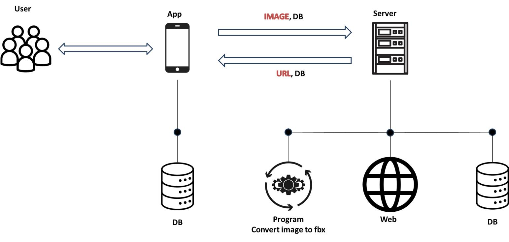

# Mobile Inventory

프로젝트로 진행한 재고관리 앱입니다.

## 개발 의의
현재 flutter에는 stl, fbx, obj 등 3d 모델링 파일 뷰어가 불안하기 때문에 이를 웹 뷰로 극복하고자 했습니다. 
사용자 앨범의 이미지를 소켓을 이용해 서버로 보낸 후 서버는 웹으로 3d 파일을 보여주고 해당 url을 사용자에게 답신합니다.  
그리고 사용자는 웹뷰를 통해 이미지의 모델링 파일을 볼 수 있습니다.
서버는 파이썬으로 구현하였고, 모델링은 three.js 를 이용했습니다.

## 시스템 구성도

## 서버
간단한 서버의 구현은 [Google](https://github.com/Ealloons/flutter_Inventory/blob/master/Server/server.py, "파이썬 ") 에 있습니다.

